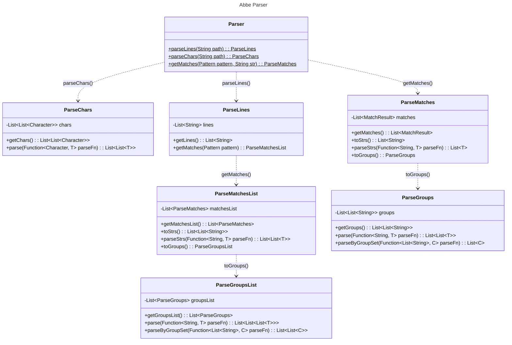

```mermaid
---
title: Abbe Parser
---
classDiagram
    class Parser{
        +parseLines(String path)$ : ParseLines
        +parseChars(String path)$ : ParseChars
        +getMatches(Pattern pattern, String str)$ : ParseMatches
    }
    Parser ..> ParseChars : parseChars()
    Parser ..> ParseLines : parseLines()
    Parser ..> ParseMatches : getMatches()

    class ParseLines{
        -List~String~ lines

        +getLines() : List~String~
        +getMatches(Pattern pattern) : ParseMatchesList
    }
    ParseLines ..> ParseMatchesList : getMatches()

    class ParseChars{
        -List~List~Character~~ chars

        +getChars() : List~List~Character~~
        +parse(Function~Character, T~ parseFn) : List~List~T~~
    }

    class ParseMatches{
        -List~MatchResult~ matches

        +getMatches() : List~MatchResult~
        +toStrs() : List~String~
        +parseStrs(Function~String, T~ parseFn) : List~T~
        +toGroups() : ParseGroups
    }
    ParseMatches ..> ParseGroups : toGroups()

    class ParseGroups{
        -List~List~String~~ groups

        +getGroups() : List~List~String~~
        +parse(Function~String, T~ parseFn) : List~List~T~~
        +parseByGroupSet(Function~List&lt;String&gt;, C~ parseFn) : List~C~
    }

    class ParseMatchesList{
        -List~ParseMatches~ matchesList

        +getMatchesList() : List~ParseMatches~
        +toStrs() : List~List~String~~
        +parseStrs(Function~String, T~ parseFn) : List~List~T~~
        +toGroups() : ParseGroupsList
    }
    %% ParseMatchesList *-- ParseMatches
    ParseMatchesList ..> ParseGroupsList : toGroups()

    class ParseGroupsList{
        -List~ParseGroups~ groupsList

        +getGroupsList() : List~ParseGroups~
        +parse(Function~String, T~ parseFn) : List~List~List~T~~~
        +parseByGroupSet(Function~List&lt;String&gt;, C~ parseFn) : List~List~C~~
    }
    %% ParseGroupsList *-- ParseGroups
```
